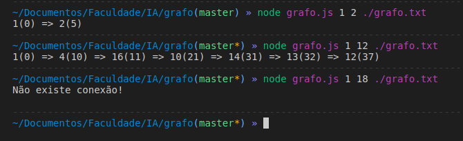

# Uniform Search for AI

Uniform search algorithm with incidence list implemented in JavaScript for college AI subjects.

[ ] This application has:

- Import .txt data file into graph

## Execute

Command line input: node <archive.js> "start node" "goal node" <archive.txt>

Output: start node(cost) => ...way to the goal... => goal(cost)

If there is no connection, it will return the message on the console

## Technologies

- ✔️ FS
